# 🌱 EcoBloom – Sowing Data, Reaping Results

EcoBloom is a community-driven environmental platform designed to make urban greening accessible, transparent, and impactful. By combining intelligent guidance on plant care with donation-enabled tree plantation initiatives, EcoBloom empowers individuals, NGOs, and communities to take meaningful action against climate change.

> 🏆 Developed as part of the B.Tech Minor-Project by Aarsh S Lal under the guidance of Dr. Nitika Nigam, School of Computer Science, UPES.

---

## 🌍 Project Vision

EcoBloom simplifies plant care and community plantation by:
- Offering expert advice using an integrated AI chatbot.
- Enabling eco-donations and tracking tree-planting impact.
- Empowering admins to coordinate and monitor local drives.
- Providing transparency through interactive dashboards.

---

## 🧩 Tech Stack

| Layer        | Technologies Used                               |
|--------------|--------------------------------------------------|
| Frontend     | React.js, Tailwind CSS, Chart.js                |
| Backend      | Node.js (Express), JWT Authentication           |
| Microservices| User Service, Admin Service, Member Service     |
| Database     | MongoDB (Mongoose ODM)                          |
| Authentication | JWT, Role-Based Access Control (RBAC)        |
| DevOps       | Docker-ready (future integration planned)       |
| Communication| NodeMailer, REST APIs, API Gateway              |

---

## 🚀 Features

### 👤 User Module
- 🌿 Donate to tree-planting campaigns.
- 🧠 Access chatbot for care tips and environmental insights.
- 📅 Register for eco-events.
- 📦 Track orders and environmental impact.

### 🔐 Admin Module
- 📊 Monitor donations and campaign analytics.
- ✅ Approve environmental reports.
- 📌 Assign and manage volunteers.

### 👷 Member Module
- 📥 Receive assignments via email.
- 🧾 Update task completion status.
- 🔔 Stay informed with alerts.

---

## 🧪 Architecture Overview

EcoBloom follows a microservices-based architecture with API Gateway routing for service abstraction, built for scalability and maintainability.

*Main Services:*
- *User Service* – Handles registrations, donations, events.
- *Admin Service* – Analytics, task assignment, verification.
- *Member Service* – Handles assigned fieldwork and reporting.
- *Authentication Service* – JWT-based secure auth.
- *Mailing Service* – Email-based notifications and confirmations.

---

## 🧠 AI-Powered Chatbot

EcoBloom integrates an AI chatbot using Gemini API for:
- Plant care recommendations.
- Answering environment-related queries.
- Navigating the application via conversational prompts.

---

## 🔐 Security Highlights

- JWT tokens with refresh mechanism.
- HTTP-only cookies for secure sessions.
- RBAC (Role-Based Access Control) for permission segregation.

---

## 📸 Screenshots

### 🏡 Landing Page
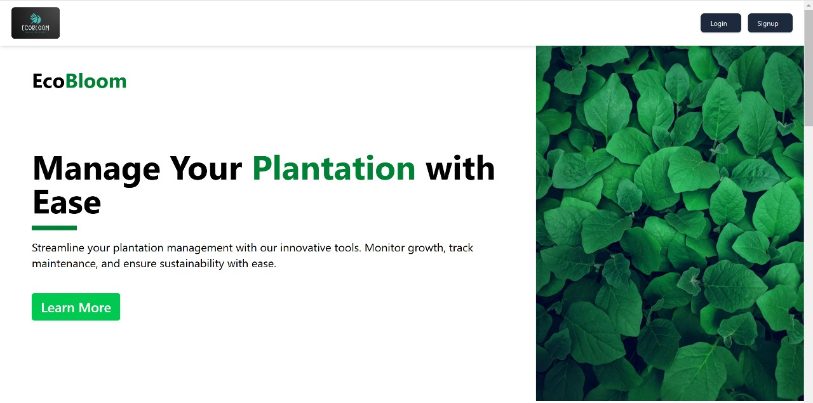

### 🔐 Signup Page
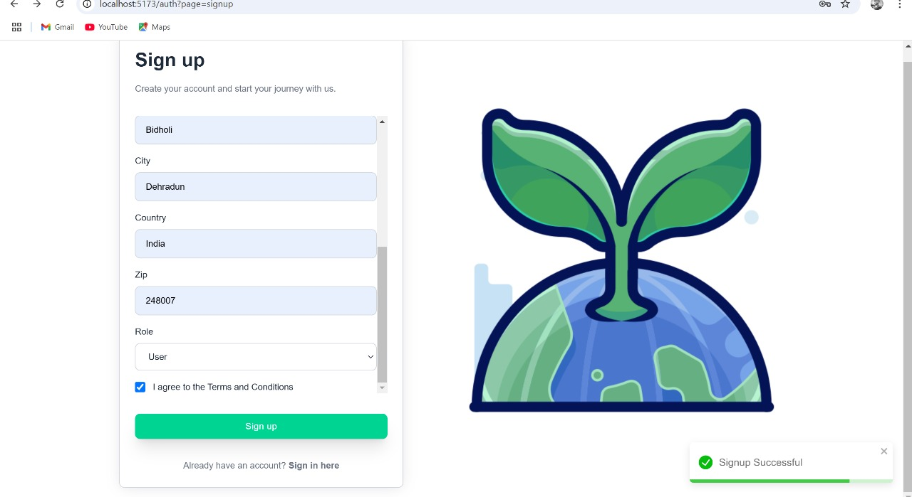

### 🔁 Forgot Password
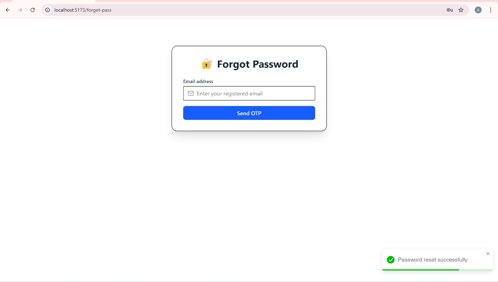

### 📧 Reset Email
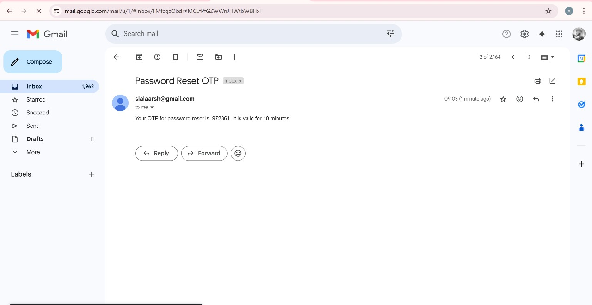

### 🧑‍💼 User Dashboard


### 🛒 Cart – User View
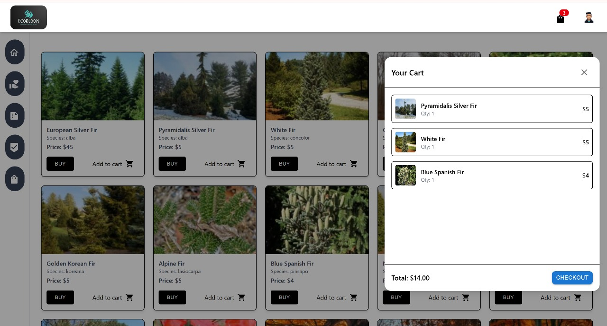

### 💬 Chatbot Interaction – 1
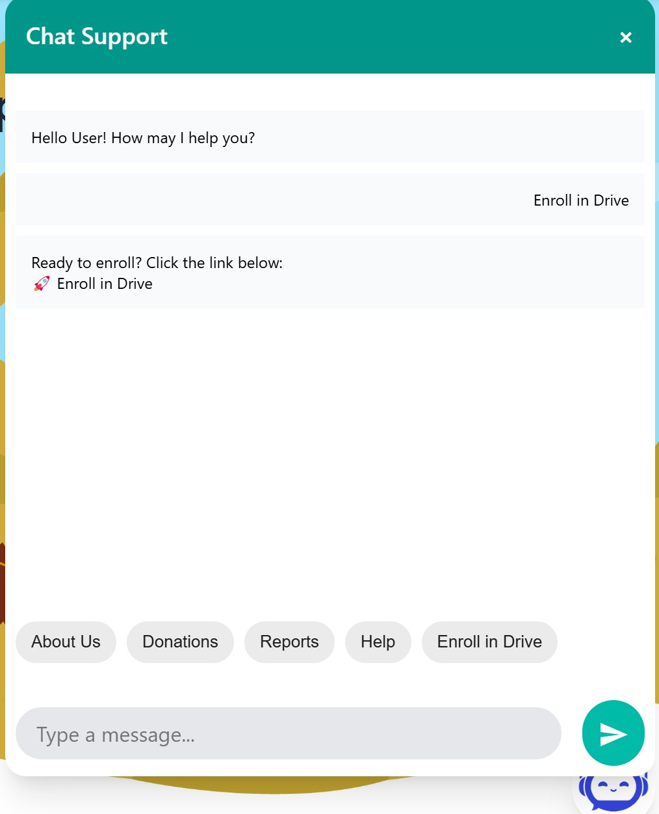

### 💬 Chatbot Interaction – 2
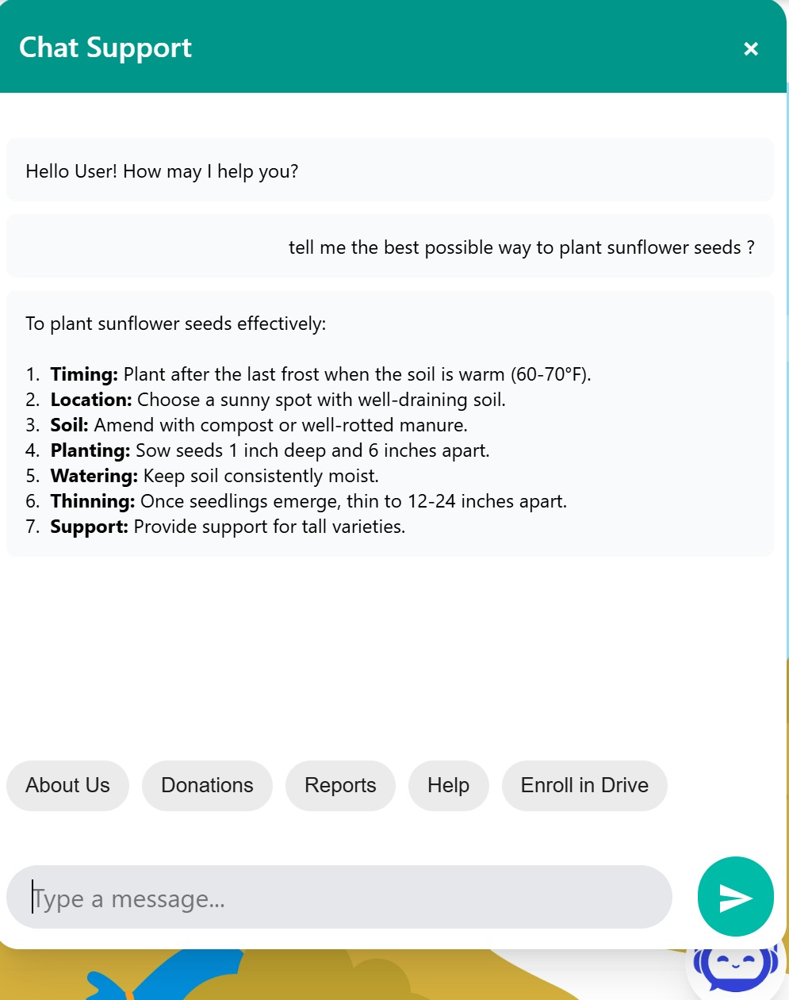

### 🌿 Donation Page
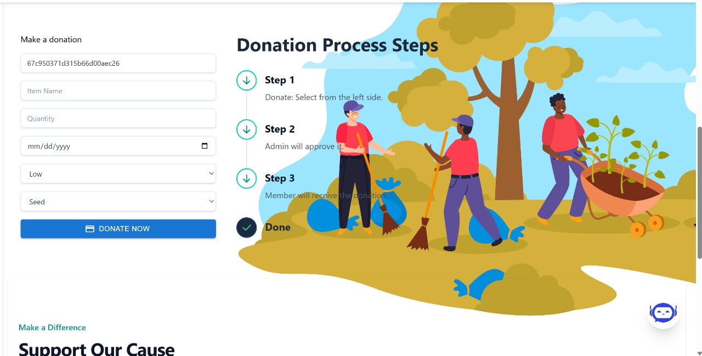

### 🧾 Donation History
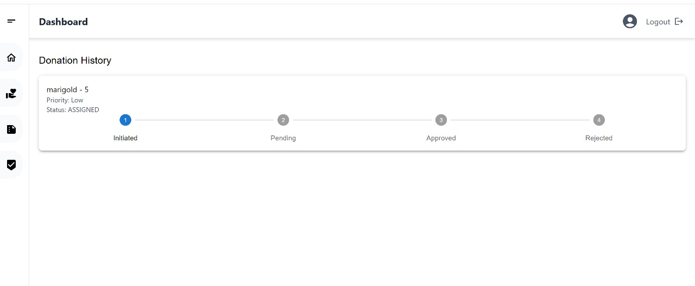

### 💬 Feedback Form
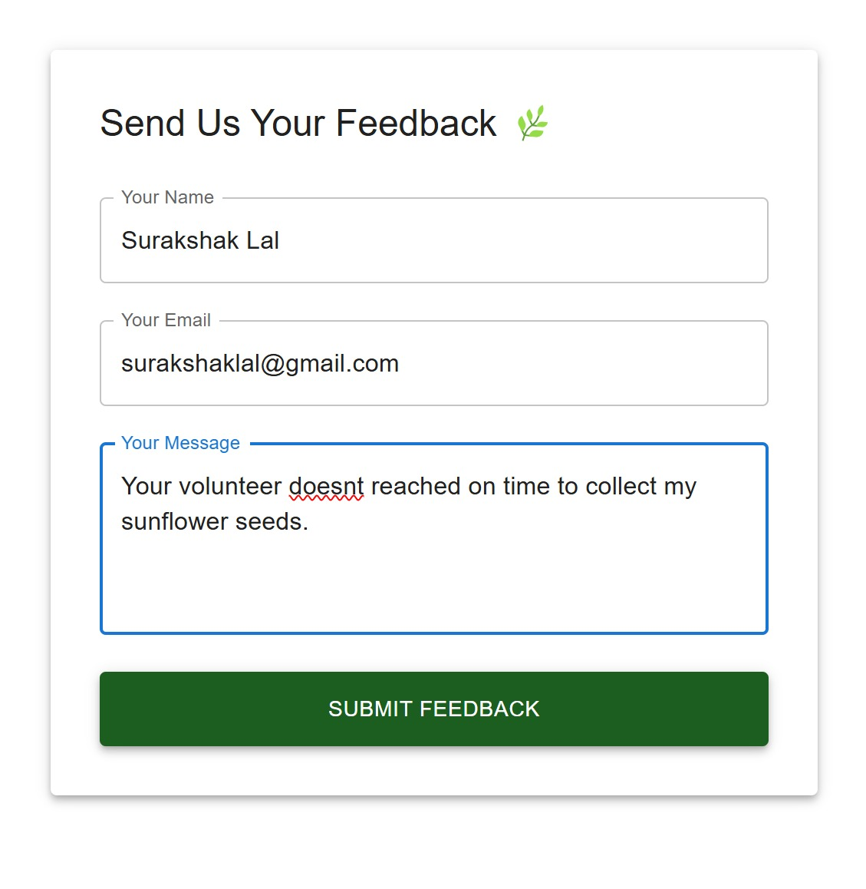

### 📩 Feedback Email Confirmation
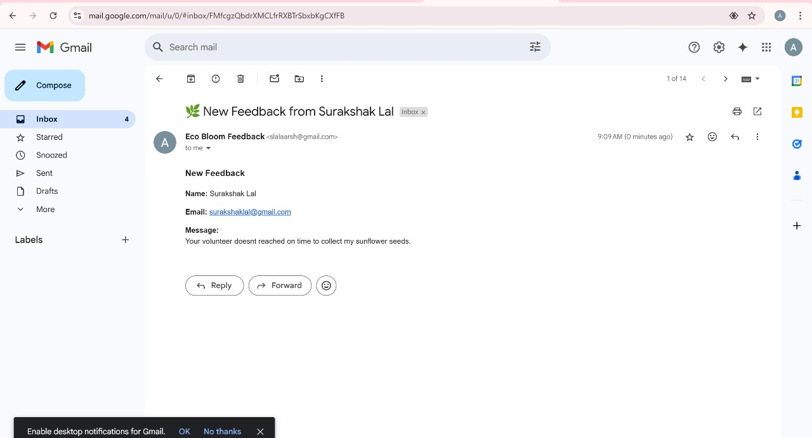

### 📝 My Reports
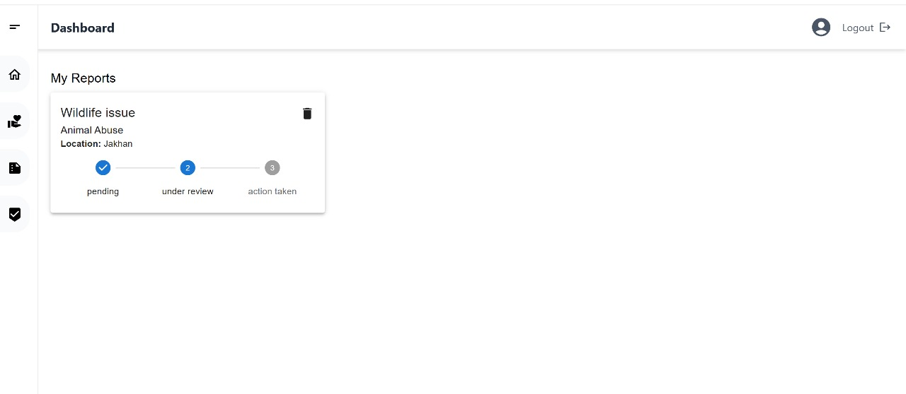

### 📅 Upcoming Drives


### 🗂 Report Details (Admin)
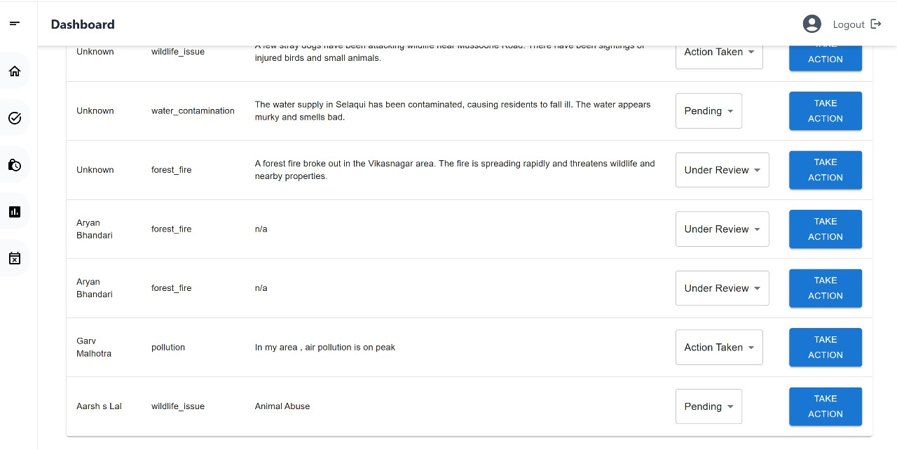

### 📊 Admin Dashboard – User View


### 🗃 Report Overview (Admin)
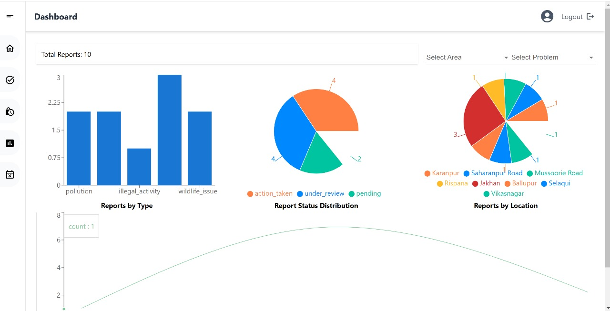


---

## 📦 Installation & Setup

```bash
# Clone the repository
git clone https://github.com/your-org/ecobloom.git
cd ecobloom

# Install backend dependencies
cd backend/apiGateway
npm i
npm run dev

cd backend/services/adminService
npm i
npm run dev

cd backend/services/authService
npm i
npm run dev

cd backend/services/mailService
npm i
npm run dev

cd backend/services/memberService
npm i
npm run dev

cd backend/services/userService
npm i
npm run dev

# Install frontend dependencies
cd ../client
npm i
npm run dev

# Run backend and frontend
Then ACCESS THE IP ADDRESS RUNNING ON LOCAL HOST : "http//---"